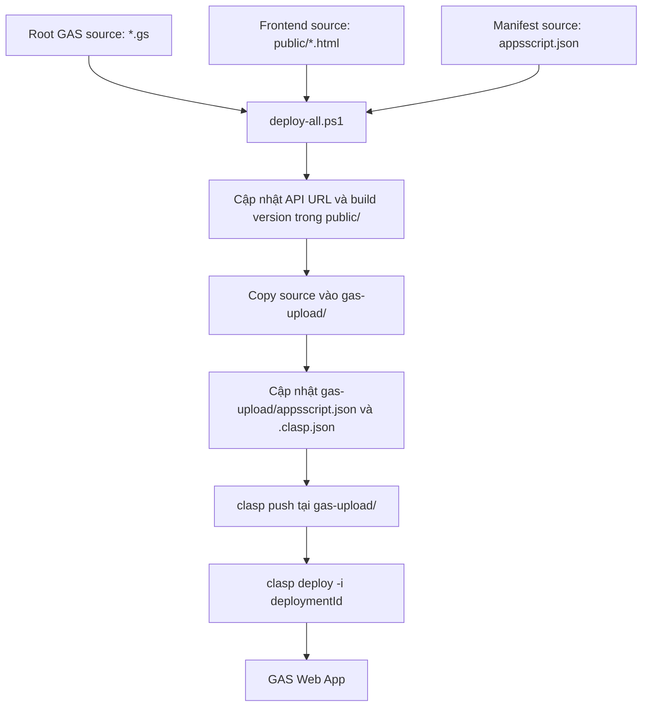
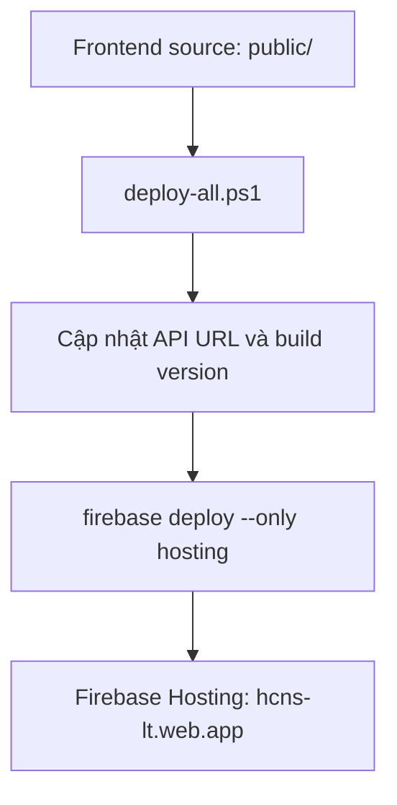
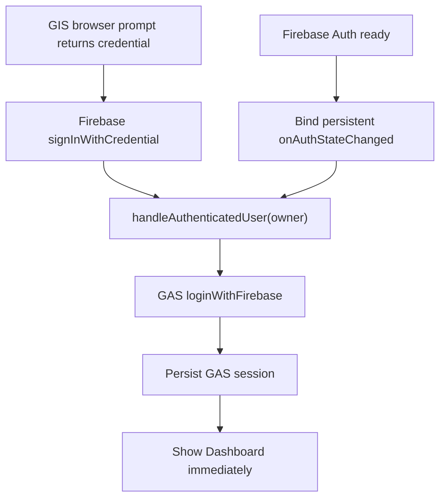

# Deploy Architecture - HanhChinh-NhanSu

Ngày cập nhật: 2026-06-01

## Source of Truth

| Thành phần | Source chính thức |
|---|---|
| Backend GAS | root `code.gs`, `employee.gs`, `employee_birth.gs`, `trigger.gs` |
| Frontend Firebase/GAS HTML | `public/` |
| GAS manifest | root `appsscript.json` |
| Deploy config | `deploy.config.psd1` |
| Deploy automation chính thức | `deploy-all.bat` -> `deploy-all.ps1` -> `deploy.config.psd1` |

`gas-upload/` là workspace deploy sinh ra. Không sửa trực tiếp file trong đó.
Root project chứa source/config/script, không phải workspace để chạy `clasp push`.

## Cấu hình clasp

- `gas-upload/.clasp.json`: cấu hình clasp đang dùng, được sinh lại từ `deploy.config.psd1`.
- Root `.clasp.json`: đã xóa vì là cấu hình legacy trỏ script khác.
- `gas-upload.clasp.json` tại root: không dùng và không cần tồn tại.

## Luồng deploy GAS



## Luồng deploy Firebase Hosting



## Trình tự deploy chuẩn

1. Sửa root `.gs`, `public/`, root `appsscript.json` và docs.
2. Chạy syntax check.
3. Chạy lệnh deploy chính thức:

```bat
deploy-all.bat --no-pause
```

4. `deploy-all.bat` gọi `deploy-all.ps1`, rồi PowerShell đọc `deploy.config.psd1`.
5. Script guard đường dẫn tuyệt đối:
   - GAS workspace phải đúng `D:\CODE\HanhChinh-NhanSu\gas-upload`;
   - `firebase.json` phải có `hosting.public = "public"`;
   - Firebase Hosting public directory phải đúng `D:\CODE\HanhChinh-NhanSu\public`.
6. Script kiểm tra tài khoản:
   - Firebase CLI: `hr@longthaisteel.com`
   - clasp: `hr@longthaisteel.com`
7. Script sync source vào `gas-upload/`.
8. Script chạy `clasp push` bên trong `gas-upload/`.
9. Script deploy Firebase Hosting từ `public/` bằng `firebase deploy --only hosting --project hcns-lt`.
10. Kiểm tra live API và UI.

## Các flow không dùng

- Không chạy `clasp push` tại root. Root `.clasp.json` legacy đã bị xóa để tránh push nhầm script.
- Không dùng `firebase deploy` thủ công từ `gas-upload/`.
- Không copy tay từng file vào `gas-upload/` trừ khi đang khôi phục khẩn cấp và đã hiểu rõ source-of-truth.

## Vai trò của deploy.bat

`deploy.bat` được giữ lại để tương thích thao tác cũ, nhưng không còn logic deploy riêng. File này chỉ in cảnh báo deprecated rồi chuyển tiếp toàn bộ tham số sang `deploy-all.bat`.

## Auth deploy checklist

Sau thay đổi auth:

1. Kiểm tra `appsscript.json` có `script.external_request`.
2. Nếu thêm scope mới, owner GAS chạy helper editor-only `authorizeFirebaseAutoLogin()` một lần để cấp consent.
3. Gọi live `loginWithFirebase` bằng token giả. Kết quả đúng là `FIREBASE_TOKEN_INVALID`, không phải lỗi quyền `UrlFetchApp.fetch`.
4. Kiểm tra Firebase Auth public config. Nếu trả `CONFIGURATION_NOT_FOUND`, mở Firebase Console Authentication, bấm **Get started**, rồi bật Google provider.
5. Kiểm tra Google provider trả `enabled: true` và public `accounts:createAuthUri` trả `providerId=google.com`.
6. Nếu dùng GIS auto-select, nhúng OAuth client id công khai vào `window.APP_CONFIG.firebaseGoogleClientId`; tuyệt đối không đưa OAuth client secret vào source.
7. Test owner session thật trên Firebase Hosting.

Sau thay đổi callback Firebase/GIS:

8. Logout hoàn toàn rồi mở Hosting.
9. Chọn owner `hr@longthaisteel.com` từ browser prompt.
10. Xác nhận Dashboard xuất hiện ngay sau auth event, không bấm F5.
11. Refresh Dashboard, logout và mở lại browser để kiểm tra persistence.

## Migration Firebase `hcns-lt` ngày 2026-06-01

- Firebase Hosting đích mới: `https://hcns-lt.web.app`.
- `.firebaserc` và `deploy.config.psd1` phải cùng trỏ `hcns-lt`.
- `firebase.json` giữ nguyên `hosting.public = "public"`.
- Firebase Auth public config đã có authorized domains `localhost`, `hcns-lt.firebaseapp.com`, `hcns-lt.web.app`.
- Google provider của project mới đã được cấu hình: public `accounts:createAuthUri` trả `providerId = google.com` và OAuth URL hợp lệ.
- Không dùng lại OAuth client id GIS của project cũ. Frontend đã nhúng client id mới `904438352439-m8706ivb3np83jgj5n06846lobgrgl8a.apps.googleusercontent.com`.
- GAS đã được push/deploy riêng từ `gas-upload/` lên deployment version `60`.
- Firebase CLI local đã thêm và chọn account owner `hr@longthaisteel.com` cho project directory.
- `firebase deploy --only hosting --project hcns-lt` đã PASS; CLI xác nhận `found 14 files in public` và release complete.
- Live `https://hcns-lt.web.app` trả `200`, chứa config `hcns-lt`, không chứa project cũ và không phát sinh log `origin_mismatch` trong browser smoke sạch.
- Owner auto-login end-to-end trên Chrome profile thật vẫn cần xác nhận sau khi profile cài Codex Chrome Extension hoặc người dùng test tương tác trực tiếp.

## Auth event flow build `260601_1544`



Không coi trạng thái prompt `displayed` là lỗi. Không chờ refresh trang để nhận Firebase user.

Deploy build `260601_1544`:

- GAS push/deploy từ `gas-upload/`: PASS, deployment version `60`.
- Firebase Hosting từ root `public/`: PASS, release `hcns-lt` complete.
